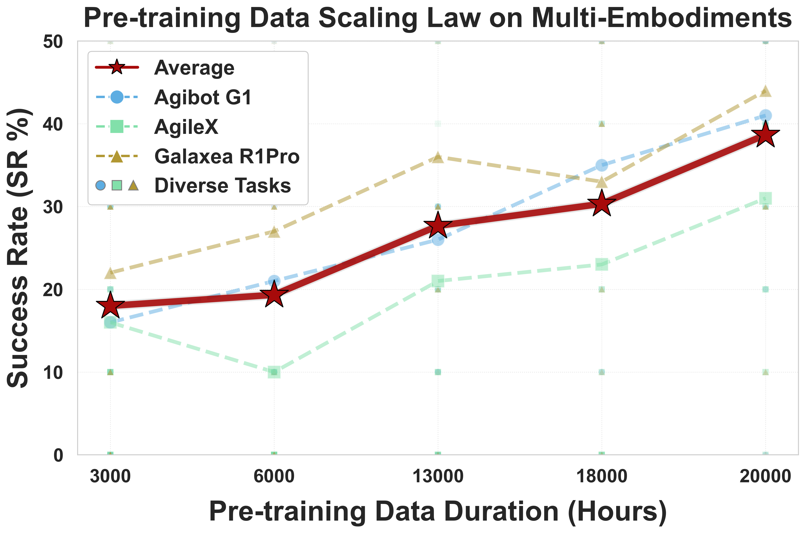
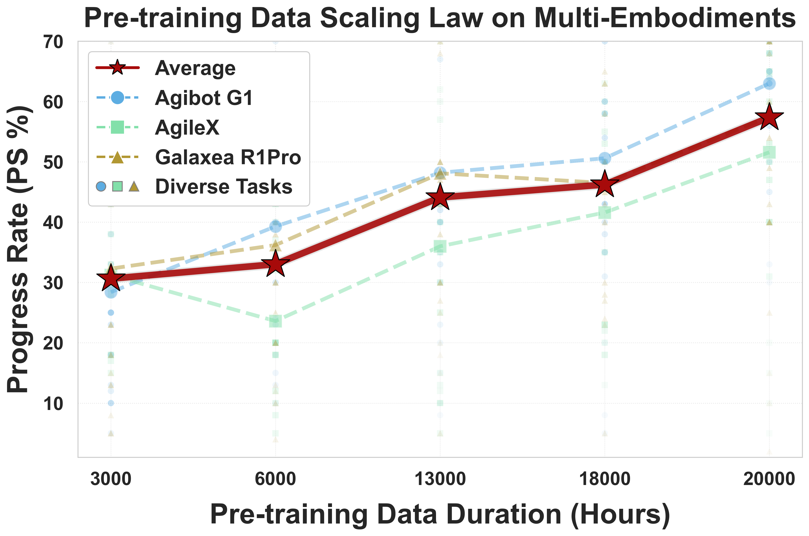
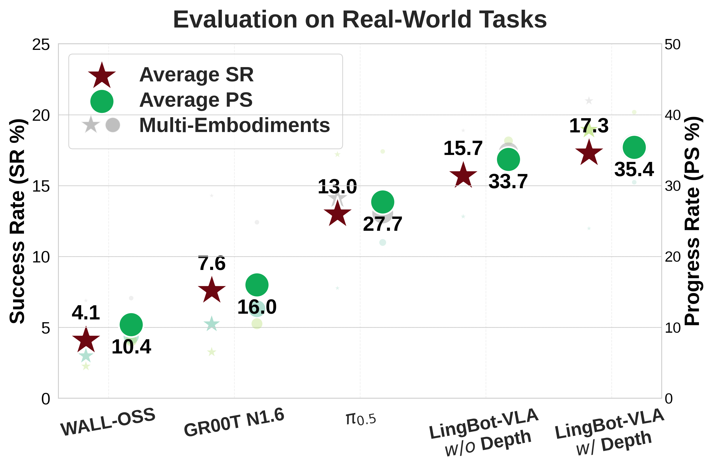
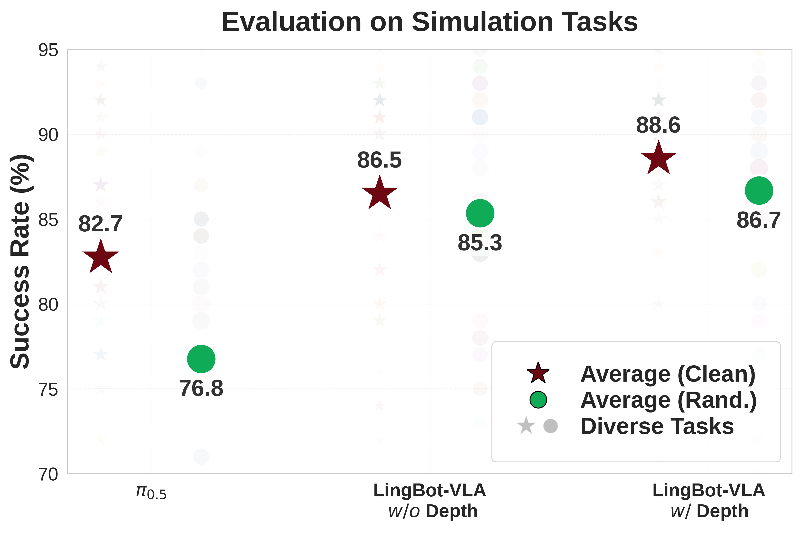

<h1 align="center">LingBot-VLA: A Pragmatic VLA Foundation Model</h1>

<p align="center">
  <a href="assets/LingBot-VLA.pdf"></a>
  <a href="https://technology.robbyant.com/lingbot-vla"></a>
  <a href="https://huggingface.co/collections/robbyant/lingbot-vla"></a>
  <a href="https://modelscope.cn/collections/Robbyant/LingBot-VLA"></a>
  <a href="LICENSE"></a>
</p>

<p align="center">
  
</p>

## 🥳 We are excited to introduce **LingBot-VLA**, a pragmatic Vision-Language-Action foundation model.

**LingBot-VLA** has focused on **Pragmatic**:
- **Large-scale Pre-training Data**: 20,000 hours of real-world
data from 9 popular dual-arm robot configurations.
<p align="center">
  
  
</p>

- **Strong Performance**: Achieve clear superiority over competitors on simulation and real-world benchmarks.
- **Training Efficiency**: Represent a 1.5 ∼ 2.8× (depending on the relied VLM base model) speedup over existing VLA-oriented codebases.

## 🚀 News
- **[2026-01-27]** LingBot-VLA Technical Report is available on Arxiv.
- **[2026-01-27]** Weights and code released!


---


## 🛠️ Installation
Requirements
 - Python 3.12.3
 - Pytorch 2.8.0
 - CUDA 12.8

```bash
# Install Lerobot
pip install torch==2.8.0 torchvision==0.23.0 torchaudio==2.8.0 --index-url https://download.pytorch.org/whl/cu128
GIT_LFS_SKIP_SMUDGE=1 git clone https://github.com/huggingface/lerobot.git
cd lerobot
git checkout 0cf864870cf29f4738d3ade893e6fd13fbd7cdb5
pip install -e .
# Install flash attention
pip install /path/to/flash_attn-2.8.3+cu12torch2.8cxx11abiTRUE-cp312-cp312-linux_x86_64.whl

# Clone the repository
git clone https://github.com/robbyant/lingbot-vla.git
cd lingbot-vla/
git submodule update --remote --recursive
pip install -e .
pip install -r requirements.txt
# Install LingBot-Depth dependency
cd ./lingbotvla/models/vla/vision_models/lingbot-depth/
pip install -e . --no-deps
cd ../MoGe
pip install -e .
```

---

## 📦 Model Download
We release LingBot-VLA pre-trained weights in two configurations: depth-free version and a depth-distillated version.
- **Pretrained Checkpoints for Post-Training with and without depth**

| Model Name | Huggingface | ModelScope | Description |
| :--- | :---: | :---: | :---: |
| LingBot-VLA-4B &nbsp; | [🤗 lingbot-vla-4b](https://huggingface.co/robbyant/lingbot-vla-4b) | [🤖 lingbot-vla-4b](https://modelscope.cn/models/Robbyant/lingbot-vla-4b) | LingBot-VLA *w/o* Depth|
| LingBot-VLA-4B-Depth | [🤗 lingbot-vla-4b-depth](https://huggingface.co/robbyant/lingbot-vla-4b-depth) | [🤖 lingbot-vla-4b-depth](https://modelscope.cn/models/Robbyant/lingbot-vla-4b-depth) | LingBot-VLA *w/* Depth |


To train LingBot with our codebase, weights from [Qwen2.5-VL-3B-Instruct](https://huggingface.co/Qwen/Qwen2.5-VL-3B-Instruct), [MoGe-2-vitb-normal](https://huggingface.co/Ruicheng/moge-2-vitb-normal), and [LingBot-Depth](https://huggingface.co/robbyant/lingbot-depth-pretrain-vitl-14) also need to be prepared.
- **Run Command**:
```bash
python3 scripts/download_hf_model.py --repo_id robbyant/lingbot-vla-4b --local_dir lingbot-vla-4b 
```
---

## 💻 Post-Training Example

- **Data Preparation**:
Please follow [RoboTwin2.0 Preparation](experiment/robotwin/README.md)

- **Training Configuration**:
We provide the mixed post-training configuration in five RoboTwin 2.0 tasks ("open_microwave" "click_bell" "stack_blocks_three" "place_shoe" "put_object_cabinet").
<details>
<summary><b>Click to expand full YAML configuration</b></summary>

```yaml
model:
  model_path: "path/to/lingbot_vla_checkpoint" # Path to pre-trained VLA foundation model (w/o or w depth)
  tokenizer_path: "path/to/Qwen2.5-VL-3B-Instruct" 
  post_training: true            # Enable post-training/fine-tuning mode
  adanorm_time: true
  old_adanorm: true

data:
  datasets_type: vla
  data_name: robotwin_5_new      
  train_path: "path/to/lerobot_merged_data" # merged data from 5 robotwin2.0 tasks
  num_workers: 8
  norm_type: bounds_99_woclip
  norm_stats_file: assets/norm_stats/robotwin_50.json # file of normalization statistics

train:
  output_dir: "path/to/output"
  loss_type: L1_fm               # we apply L1 flow-matching loss in robotwin2.0 finetuning
  data_parallel_mode: fsdp2      # Use Fully Sharded Data Parallel (PyTorch FSDP2)
  enable_full_shard: false       # Don't apply reshare after forward in FSDP2
  module_fsdp_enable: true
  use_compile: true              # Acceleration via torch.compile
  use_wandb: false
  rmpad: false
  rmpad_with_pos_ids: false
  ulysses_parallel_size: 1
  freeze_vision_encoder: false   # ViT need to be optimized
  tokenizer_max_length: 24       # token numbers of task prompt
  action_dim: 14                 # Target robot action space dimension
  max_action_dim: 75             # action dim in LingBot-VLA
  max_state_dim: 75              # state dim in LingBot-VLA
  lr: 1.0e-4
  lr_decay_style: constant
  num_train_epochs: 69           # finetuning 20k step
  micro_batch_size: 32
  global_batch_size: 256
  max_steps: 220000
  ckpt_manager: dcp
  save_steps: 220000
  save_epochs: 69
  enable_fp32: true
  enable_resume: true            # resume training automatically
  # ===========================================================================
  # Depth Injection Parameters 
  # (Required only for LingBot-VLA with Depth. Ignore if not using depth)
  # ===========================================================================
  align_params:
    mode: 'query'                  # Query-based distillation
    num_task_tokens: 8             # Number of learnable task-specific tokens
    use_image_tokens: True
    use_task_tokens: False
    use_text_tokens: False
    use_contrastive: True
    contrastive_loss_weight: 0.3
    depth_loss_weight: 0.002
    llm:                           # VLM Projection Settings
      dim_out: 2048
      image_token_size: 8
      image_input_size: 224
    depth:
      model_type: MoRGBD
      moge_path: /"path/to/moGe-2-vitb-normal"
      morgbd_path: "path/to/LingBot-Depth"
      num_layers: 1
      num_heads: 4
      dim_head: 32
      ff_mult: 1
      num_backbone_tokens: 256
      token_size: 16
      dim_out: 1024
      input_size: 224
    visual_steps: 10000
    visual_dir: "path/to/output/images" # visualization path of depth distillation
```
</details>

- **Run Command**:
```bash
# without detph
bash train.sh tasks/vla/train_lingbotvla.py ./configs/vla/robotwin_load20000h.yaml  --model.model_path /path/to/LingBot-VLA --data.train_path path/to/mixed_robotwin_5tasks --train.output_dir /path/to/lingbot_robotwin5tasks/ --model.tokenizer_path /path/to/Qwen2.5-VL-3B-Instruct --train.micro_batch_size ${your_batch_size} --train.global_batch_size ${your_batch_size * your_gpu_num}

# with depth
bash train.sh tasks/vla/train_lingbotvla.py ./configs/vla/robotwin_load20000h_depth.yaml  --model.model_path /path/to/LingBot-VLA-Depth  --data.train_path /path/to/mixed_robotwin_5tasks --train.output_dir /path/to/lingbot_depth_robotwin5tasks --model.tokenizer_path /path/to/Qwen2.5-VL-3B-Instruct --model.moge_path /path/to/moge2-vitb-normal.pt --model.morgbd_path /path/to/LingBot-Depth-Pretrained --train.micro_batch_size ${your_batch_size} --train.global_batch_size ${your_batch_size * your_gpu_num}
```

- **Evaluation**  
```bash
# robotwin2.0
export QWEN25_PATH=path_to_Qwen2.5-VL-3B-Instruct
python -m deploy.lingbot_robotwin_policy \
 --model_path path_to_your_model \
 --use_length 50 \
 --port port
```

- **Customized Post-training**
To construct post-training in specified downstream tasks, we have provided an example and please refer to [Custom](lingbotvla/data/vla_data/README.md) for details.
---

## 🏗️ Efficiency
<p align="center">
  
</p>
We evaluate the training efficiency of our codebase against established baselines for both <b>Qwen2.5-VL-3B-π</b> and <b>PaliGemma-3B-pt-224-π</b> models. The results demonstrate that our codebase
achieved the fastest training speeds in both model settings. The above figures detail the training throughput across configurations of 8, 16, 32, 128, and 256 GPUs, alongside the theoretical linear scaling limit.

---

## 📊 Performance

Our LingBot-VLA achieves state-of-the-art results on real-world and simulation benchmarks:
- **GM-100 across 3 robot platforms**

<table>
  <thead>
    <tr>
      <th rowspan="2">Platform</th>
      <th colspan="2">WALL-OSS</th>
      <th colspan="2">GR00T N1.6</th>
      <th colspan="2">π<sub>0.5</sub></th>
      <th colspan="2">Ours w/o depth</th>
      <th colspan="2">Ours w/ depth</th>
    </tr>
    <tr>
      <th>SR</th><th>PS</th>
      <th>SR</th><th>PS</th>
      <th>SR</th><th>PS</th>
      <th>SR</th><th>PS</th>
      <th>SR</th><th>PS</th>
    </tr>
  </thead>
  <tbody>
    <tr>
      <td>Agibot G1</td>
      <td>2.99%</td><td>8.75%</td><td>5.23%</td><td>12.63%</td><td>7.77%</td><td>21.98%</td><td><b>12.82%</b></td><td>30.04%</td><td>11.98%</td><td><b>30.47%</b></td>
    </tr>
    <tr>
      <td>AgileX</td>
      <td>2.26%</td><td>8.16%</td><td>3.26%</td><td>10.52%</td><td>17.20%</td><td>34.82%</td><td>15.50%</td><td>36.31%</td><td><b>18.93%</b></td><td><b>40.36%</b></td>
    </tr>
    <tr>
      <td>Galaxea R1Pro</td>
      <td>6.89%</td><td>14.13%</td><td>14.29%</td><td>24.83%</td><td>14.10%</td><td>26.14%</td><td>18.89%</td><td>34.71%</td><td><b>20.98%</b></td><td><b>35.40%</b></td>
    </tr>
    <tr>
      <td><b>Average</b></td>
      <td>4.05%</td><td>10.35%</td><td>7.59%</td><td>15.99%</td><td>13.02%</td><td>27.65%</td><td>15.74%</td><td>33.69%</td><td><b>17.30%</b></td><td><b>35.41%</b></td>
    </tr>
  </tbody>
</table>


- **RoboTwin 2.0 (Clean and Randomized)**

<table>
  <thead>
    <tr>
      <th rowspan="2" ><b>Simulation Tasks</b></th>
      <th colspan="2"><b>&pi;<sub>0.5</sub></b></th>
      <th colspan="2"><b>Ours w/o depth</b></th>
      <th colspan="2"><b>Ours w/ depth</b></th>
    </tr>
    <tr>
      <th><b>Clean</b></th>
      <th><b>Rand.</b></th>
      <th><b>Clean</b></th>
      <th><b>Rand.</b></th>
      <th><b>Clean</b></th>
      <th><b>Rand.</b></th>
    </tr>
  </thead>
  <tbody>
    <tr style="border-top: 1px solid #ccc;"> <!-- \midrule -->
      <td><b>Average SR</b></td>
      <td>82.74%</td>
      <td>76.76%</td>
      <td>86.50%</td>
      <td>85.34%</td>
      <td>88.56%</td>
      <td>86.68%</td>
    </tr>
    <!-- 您可以在此处继续添加其他任务行 -->
  </tbody>
</table>

<p align="center">
  
  
</p>

---

## 📝 Citation

If you find our work useful in your research,  feel free to give us a cite.

```bibtex
@article{wu2026pragmatic,
  title={A Pragmatic VLA Foundation Model},
  author={Wei Wu and Fan Lu and Yunnan Wang and Shuai Yang and Shi Liu and Fangjing Wang and Shuailei Ma and He Sun and Yong Wang and Zhenqi Qiu and Houlong Xiong and Ziyu Wang and Shuai Zhou and Yiyu Ren and Kejia Zhang and Hui Yu and Jingmei Zhao and Qian Zhu and Ran Cheng and Yong-Lu Li and Yongtao Huang and Xing Zhu and Yujun Shen and Kecheng Zheng},
  journal={arXiv preprint arXiv:2601.18692v1},
  year={2026}
}
```

---

## 📄 License Agreement
This project is licensed under the [Apache-2.0 License](LICENSE).

## 😊 Acknowledgement
We would like to express our sincere gratitude to the developers of [VeOmni](https://arxiv.org/abs/2508.02317) and [LeRobot](https://github.com/huggingface/lerobot#). This project benefits significantly from their outstanding work and contributions to the open-source community.
